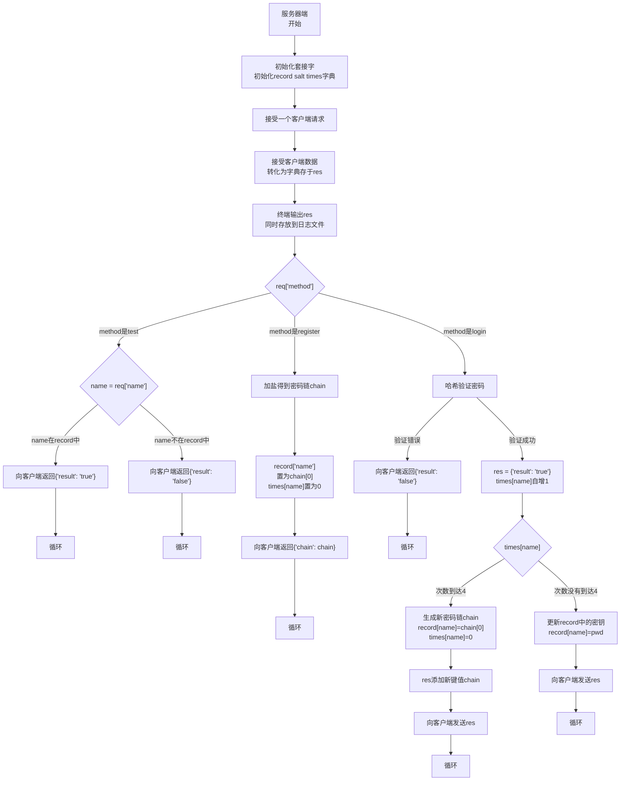
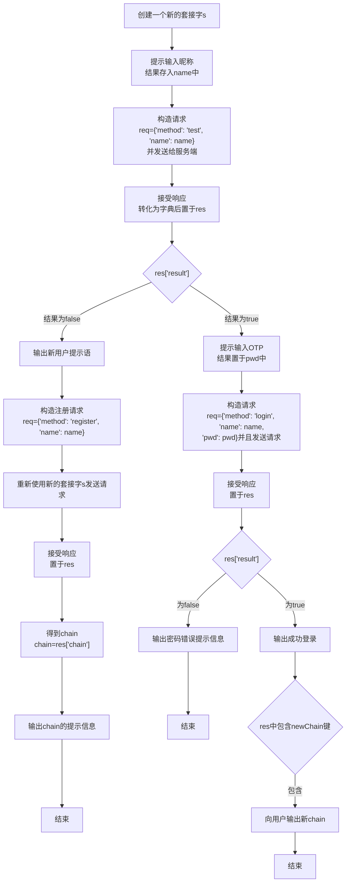

```mermaid
graph TD
1["服务器端<br>开始"]
2["初始化套接字<br>初始化record salt times字典"]
3["接受一个客户端请求"]
4["接受客户端数据<br>转化为字典存于res"]
5["终端输出res<br>同时存放到日志文件"]
6{"req['method']"}

7{"name = req['name']"}
8["向客户端返回{'result': 'true'}"]
9["向客户端返回{'result': 'false'}"]

10["加盐得到密码链chain"]
11["record['name']<br>置为chain[0]<br>times[name]置为0"]
12["向客户端返回{'chain': chain}"]

13["哈希验证密码"]
14["向客户端返回{'result': 'false'}"]
15["res = {'result': 'true'}<br>times[name]自增1"]
16{"times[name]"}
17["生成新密码链chain<br>record[name]=chain[0]<br>times[name]=0"]
18["res添加新键值chain"]
19["向客户端发送res"]
20["更新record中的密钥<br>record[name]=pwd"]
21["向客户端发送res"]

1-->2-->3-->4-->5-->6
6--"method是test"-->7
7--"name在record中"-->8-->x1["循环"]
7--"name不在record中"-->9-->x2["循环"]

6--"method是register"-->10
10-->11-->12-->x3["循环"]

6--"method是login"-->13
13--"验证错误"-->14-->x4["循环"]
13--"验证成功"-->15
15-->16
16--"次数到达4"-->17
17-->18-->19-->x5["循环"]
16--"次数没有到达4"-->20-->21-->x6["循环"]

```

```mermaid
graph TD
1["创建一个新的套接字s"]
2["提示输入昵称<br>结果存入name中"]
3["构造请求<br>req={'method': 'test', 'name': name}\n并发送给服务端"]
4["接受响应<br>转化为字典后置于res"]
5{"res['result']"}
6["输出新用户提示语"]
7["构造注册请求<br>req={'method': 'register', 'name': name}"]
8["重新使用新的套接字s发送请求"]
9["接受响应<br>置于res"]
10["得到chain<br>chain=res['chain']"]
11["输出chain的提示信息"]

12["提示输入OTP<br>结果置于pwd中"]
13["构造请求<br>req={'method': 'login', 'name': name,<br>'pwd': pwd}并且发送请求"]
14["接受响应<br>置于res"]
15{"res['result']"}
16["输出密码错误提示信息"]

17["输出成功登录"]
18{"res中包含newChain键"}

19["向用户输出新chain"]
1-->2-->3-->4-->5
5--"结果为false"-->6-->7-->8-->9-->10-->11-->x1["结束"]

5--"结果为true"-->12-->13-->14-->15
15--"为false"-->16-->x2["结束"]
15--"为true"-->17-->18
18--"包含"-->19-->x3["结束"]
```

